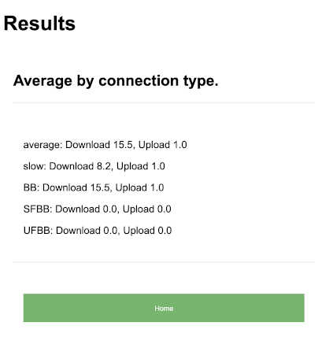

# demo-api

This is a LifeWorks application demo for checking internet connection speeds by postcode and connection type. It includes API endpoints and a web application interface and command line tools used to manage database tables. Average internet speed is displayed in Mbit/s.

To make an assessment of internet connectivity, I decided to focus on internet speed. At a high level, I use download speed and upload speed to assess the quality of the user’s network connection. Poor broadband speeds affect the liveability of homes and the viability and productivity of businesses.

Although, increasing internet speed in the UK is due to the growing availability and take-up of superfast and ultrafast fibre and cable broadband services, I have decided not to visualise the availability % data. I have, however, included average speeds by connection type: slow speed lines < 10Mbit/s, Basic BB lines, SFBB lines, and UFBB lines.

If the average speed for SFBB lines for a given postcode is 0 Mbit/s, the count of connections that have average measured speeds of 30Mbit/s or greater is 0. This does not mean that SFBB is not available in that particular area.

If the average speed for UFBB lines for a given postcode is 0 Mbit/s, that means that the count of connections that have average measured speeds of 300Mbit/s or greater is 0.

It would be advisable for internet provider technicians to confirm the postcode-level availability of superfast and ultrafast broadband.

For the data storage, the postcodes were split into various parts to have a quick postcode reference cache available to prevent making database reads on every request. The readings were also split by connection type into separate tables for smaller table sizes.

## Application main page

*(Basic authentication omitted for this demo purposefully)*

    http://localhost:8080/

## Basic API endpoint description

* postcode: A postcode with no spaces. Example, AB101AU.
* connection: An optional connection type. If missing 'average' is the default.

| value    | Description                                           |
| --------:| ----------------------------------------------------- |
| average  | Average (Mbit/s) of all connection types              |
| slow     | Average (Mbit/s) for lines <10Mbit/s                  |
| BB       | Average (Mbit/s) for Basic BB (Broadband) lines       |
| SFBB     | Average (Mbit/s) for SFBB (Superfast Broadband) lines |
| UFBB     | Average (Mbit/s) for UFBB (Ultrafast Broadband) lines |

## Basic api endpoint examples

    http://localhost:8080/api/average?postcode=AB101AU
    http://localhost:8080/api/average?postcode=AB101AU&connection=all
    http://localhost:8080/api/average?postcode=AB101AU&connection=BB
    http://localhost:8080/api/average?postcode=AB101AU&connection=slow
    http://localhost:8080/api/average?postcode=AB101AU&connection=average

## Development

    tox -e develop
    source env/bin/activate
    cp development.ini.dist development.ini
    demo-api-initialisedb ./development.ini
    pserve --reload development.ini

## Testing

To run tests in an existing environment.

    pytest

### Manual prerequisites

*TOX*
    
Can install via package manager to build the env.
    
https://tox.readthedocs.io/en/latest/

*MySQL*

Must initialize a DB with name irdemoapi.

Create and give permissions to a demo user in MySQL.

Username: demouser
Password: demouser

*Specify a custom username and password in the development ini for the MySQL authentication.*

## Initialize or clear database

    demo-api-initialisedb ./development.ini
    demo-api-initialisedb ./development.ini --drop-database

## Populate database

### Download fixed postcode ZIP data from a source

Example:

https://www.ofcom.org.uk/research-and-data/multi-sector-research/infrastructure-research/connected-nations-2016/downloads

### Unzip the data files to a local folder

Example download link:

https://www.ofcom.org.uk/static/research/connected-nations2016/2016_fixed_pc_r01.zip

### Populate data from files in folder using shell tool

    demo-api-updatedb ./development.ini 2016 ~/Downloads/2016_fixed_pc_r01/
